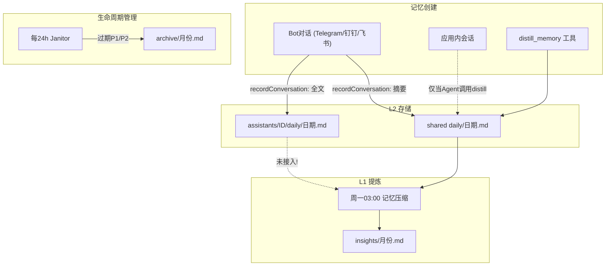

# 记忆系统问题诊断与修复方案

> 状态：已实施（Phase 1）
> 记忆系统在定时 Insight 生成、心跳记忆读取范围、应用内会话记忆记录三个核心环节存在缺陷，可能导致记忆无法正常积累和总结。

## 问题全景

记忆系统采用 L0/L1/L2 三级架构 + P0/P1/P2 生命周期管理，核心数据流为：

---

## BUG 1 (严重): 每周记忆压缩(Insight生成)几乎不可能触发

**文件**: src/electron/libs/heartbeat.ts 第 263-302 行

**问题清单**:

- `getMinutes() === 0` 要求恰好命中 03:00 那一分钟，极易错过
- `lastCompactWeek` 是内存变量，重启即丢失
- `lastCompactWeek = week` 在 runner 调用前设置，失败也算"已完成"
- `getISOWeek` 返回 1-53，跨年回绕时 `currentWeek > lastCompactWeek` 失效

**修复方案（四层保障）**:

### 1) 放宽定时窗口

去掉 `getMinutes() === 0`，周一 03:xx 整个小时内都可触发。

### 2) 跨年安全的持久化 key

不再存裸 week 数字，改为 `"YYYY-Wnn"` 格式字符串（如 `"2026-W12"`），持久化到 `~/.vk-cowork/memory/.last-compact-key`。字符串排序天然跨年安全。

### 3) 启动时追补（catch-up）

`startMemoryCompactTimer` 启动时立即读取磁盘上的 lastKey，如果 `currentKey > lastKey`（字符串比较），延迟 10 秒后补跑。覆盖"软件关闭期间错过压缩"的场景。

### 4) 失败不标记完成

将 `lastCompactKey` 的更新从 runner 调用前移到 compaction 完成回调中。仅在成功时写入 key。失败时保留旧 key，下次定时检查或重启追补时自动重试。

---

## BUG 2 (中等): 心跳只读共享日志，遗漏 Bot 对话全文

**文件**: src/electron/libs/heartbeat.ts

### 2a) readMemoryDelta 只读共享 daily

**修复**: 在 `buildHeartbeatPrompt` 中通过 `ScopedMemory(assistantId)` 同时读取 assistant daily 的增量内容，合并到心跳提示词。

### 2b) mtime 优化只检查共享 daily

**修复**: mtime 检查增加 assistant daily 文件。取两者 mtime 的 max 值来判断是否有变化。

---

## BUG 3 (中等): 记忆压缩只处理共享日志，Per-Assistant 日志被忽略

**文件**: src/electron/libs/heartbeat.ts 第 279-283 行

### 3a) 压缩提示词只指向 shared daily

**修复**: 提示词追加指令，要求同时读取 `~/.vk-cowork/memory/assistants/*/daily/` 下最近 7 天的文件，合并提炼。

### 3b) 只用 default assistant 执行，其他 assistant 的 insights 目录为空

**修复**: 遍历所有已配置的 assistant，为每个分别生成 insights。

---

## BUG 4 (中等): 应用内会话不写入每日记忆

**文件**: src/electron/ipc-handlers.ts

**修复**: 在 session 状态变为 `idle`/`completed` 时，新增记忆记录逻辑：

1. 用 `buildConversationDigest(allMessages)` 生成摘要
2. 构造一行 summary 写入 shared daily
3. 如有 assistantId，写入 assistant daily

跳过条件: background session、心跳 session、经验候选 session、记忆压缩 session。

---

## BUG 5 (低): Preload API 不传 assistantId

**文件**: src/electron/preload.cts

**修复**: 为 `memoryRead`、`memoryWrite`、`memoryList` 增加可选的 `assistantId` 参数并透传到 IPC。

---

## 改进 6: 压缩执行的可观测性

- 压缩成功时在 `insights/` 目录写入 `.last-run` 文件
- `memoryList` IPC 返回值中增加 `lastCompactionAt` 字段

---

## 修改文件总览

- **src/electron/libs/heartbeat.ts** — 主战场，涉及 BUG 1/2/3 + 改进 6
- **src/electron/ipc-handlers.ts** — BUG 4 (应用内会话记录) + BUG 1 (压缩完成回调)
- **src/electron/libs/memory-store.ts** — 改进 6 (memoryList 增加 lastCompactionAt)
- **src/electron/preload.cts** — BUG 5 (透传 assistantId)
- **types.d.ts** — 更新 MemoryListResult 类型定义
