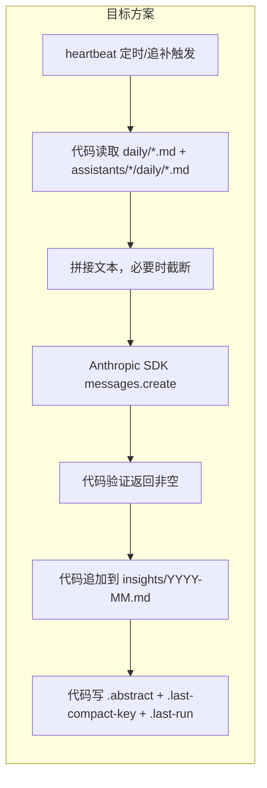

# 程序化记忆压缩重构

> 状态：待实施（Phase 2，基于 Phase 1 之上）
> 将每周记忆压缩从 AI Session 改为程序化实现（代码控制读写 + Anthropic SDK 直接调用做文本提炼），提升可靠性。

## 背景

Phase 1 修复了压缩调度的定时问题，但压缩执行仍然依赖 AI Session（让 AI 自己调用 file_read/file_write），存在以下弊端：

- AI 可能跳过某些文件或决定不写入
- 无法验证 AI 实际写了什么
- 每次压缩启动一个完整 Agent session，成本高
- session 状态 idle ≠ 压缩真正完成

## 架构变更



## 新建文件

**src/electron/libs/memory-compactor.ts**

直接使用 `@anthropic-ai/sdk`（参考 dingtalk-bot.ts 的 `getAnthropicClient` 模式），API key 从 app settings 读取。

### 核心逻辑

```typescript
import Anthropic from "@anthropic-ai/sdk";
import { loadUserSettings } from "./user-settings.js";

const DEFAULT_MODEL = "claude-sonnet-4-20250514";
const MAX_INPUT_CHARS = 15000;
const API_TIMEOUT_MS = 60_000;

export interface CompactionResult {
  success: boolean;
  insightLines: number;
  error?: string;
}

function getClient(): Anthropic {
  const s = loadUserSettings();
  const apiKey = s.anthropicAuthToken || process.env.ANTHROPIC_API_KEY || "";
  if (!apiKey) throw new Error("未配置 API Key");
  return new Anthropic({
    apiKey,
    baseURL: s.anthropicBaseUrl || undefined,
    timeout: API_TIMEOUT_MS,
  });
}
```

### collectDailyLogs(days: number)

- 读取 `memory/daily/` 最近 N 天
- 读取 `memory/assistants/*/daily/` 最近 N 天
- 返回 `{ date, source, content }[]`
- 使用现有 `listDailyMemories()` + `ScopedMemory.listDailies()` + `readFileSync`

### distillViaAPI(logsText: string, yearMonth: string)

- 调用 `client.messages.create()` 一次
- 提示词：纯文本变换，不需要工具
- 超时 60 秒，失败返回 null
- 输入截断到 MAX_INPUT_CHARS（优先保留最近的日期）

**提示词设计**：

```
你是记忆蒸馏助手。分析以下一周的对话和工作日志，提炼出值得长期保留的关键洞察。

要求：
- 输出 3-10 条洞察，每条以 "- " 开头
- 每条聚焦一个独立的事实、决策、经验或发现
- 不超过 100 字/条
- 只输出洞察列表，不要输出其他内容

日志内容：
{logsText}
```

### runProgrammaticCompaction(assistantIds: string[])

```
1. collectDailyLogs(7)
2. 拼接为文本，截断到 MAX_INPUT_CHARS
3. 如果文本 < 100 chars → 跳过（无内容可压缩），返回 success
4. distillViaAPI(text, yearMonth)
5. 验证返回值非空且包含 "- " 格式
6. 追加到 insights/YYYY-MM.md（带 "## Week of YYYY-MM-DD" 标题，防重复追加时可识别）
7. 对每个 assistantId 也追加到 assistants/{id}/insights/YYYY-MM.md
8. refreshRootAbstract()
9. 返回 CompactionResult
```

**幂等性保护**：写入时以 `## Week of {日期}` 作为分段标题。写入前检查文件中是否已存在相同标题，有则跳过（防崩溃重试导致重复）。

## 修改文件

### src/electron/libs/heartbeat.ts

- 删除 `buildCompactionPrompt()`, `runCompaction()`, `pendingCompactKey`, `onCompactionResult()` 导出
- `startMemoryCompactTimer` 中改为：

```typescript
const checkCompaction = async () => {
  if (compactionRunning) return; // 防重入锁
  const now = new Date();
  const key = compactKey(now);
  if (now.getDay() === 1 && now.getHours() === 3 && key !== lastCompactKey) {
    compactionRunning = true;
    try {
      const config = loadAssistantsConfig();
      const result = await runProgrammaticCompaction(
        config.assistants.map(a => a.id)
      );
      if (result.success) {
        lastCompactKey = key;
        writeLastCompactKey(key);
        writeLastRunMetadata(key);
      }
    } catch (e) {
      console.error("[Heartbeat] Compaction error:", e);
    } finally {
      compactionRunning = false;
    }
  }
};
```

关键变化：

- `pendingCompactKey` 替换为 `compactionRunning` 布尔锁
- 持久化直接在成功后内联完成，不依赖 ipc-handlers 回调
- `catch` 兜底：失败 → 不持久化 → 下次定时器自动重试
- catch-up 逻辑同理，启动时检测 `currentKey > lastKey` 则直接 await

### src/electron/ipc-handlers.ts

- 删除 `import { onCompactionResult } from './libs/heartbeat.js'`
- 删除 `[记忆压缩]` session 检测的 4 行代码（不再需要）

### src/electron/main.ts

- `readLastCompactionAt` 仍从 heartbeat.ts 导入（保持不变）
- 新增 IPC handler `run-compaction`，供 UI 手动触发

```typescript
ipcMainHandle("run-compaction", async () => {
  const config = loadAssistantsConfig();
  const result = await runProgrammaticCompaction(
    config.assistants.map(a => a.id)
  );
  if (result.success) {
    writeLastCompactKey(compactKey(new Date()));
    writeLastRunMetadata(compactKey(new Date()));
  }
  return result;
});
```

### src/electron/preload.cts

- 新增 `runCompaction: () => ipcInvoke("run-compaction")`

### types.d.ts

- 新增 IPC channel 和 ElectronAPI 类型：

```typescript
"run-compaction": { success: boolean; insightLines: number; error?: string };
// ...
runCompaction: () => Promise<{ success: boolean; insightLines: number; error?: string }>;
```

### src/ui/components/KnowledgePage.tsx

在记忆 tab 的标题栏，在"打开目录"按钮旁添加"立即提炼"按钮：

- 新增 state: `compacting` (boolean), `lastCompactionAt` (string)
- refresh 时从 `memoryList().lastCompactionAt` 读取上次提炼时间
- 按钮点击: `await window.electron.runCompaction()`
- 按钮状态: 提炼中显示 spinner + "提炼中..."，完成后刷新页面并 toast 结果
- 按钮下方: 显示"上次提炼: YYYY-MM-DD HH:mm"（如果有 `lastCompactionAt`）

UI 布局：

```
┌──────────────────────────────────────────────────┐
│ 长期记忆（MEMORY.md）        [立即提炼] [打开目录] │
│                                                  │
│ (pre block: memoryContent)                       │
│                                                  │
├──────────────────────────────────────────────────┤
│ 上次提炼: 2026-03-03 03:15  │  记忆目录包含...    │
└──────────────────────────────────────────────────┘
```

## 不在本次范围

- `experience-extractor.ts` 和 `util.ts` 的 `unstable_v2_prompt` 迁移（留后续 TODO）
- 多周补跑（当前只补跑当前周，够用；后续可扩展为逐周回溯）
