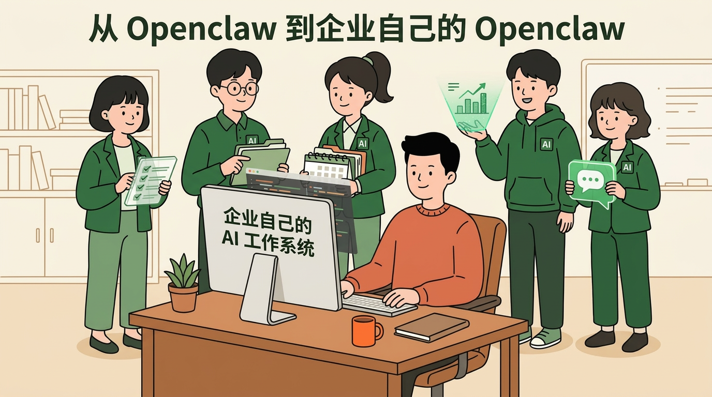
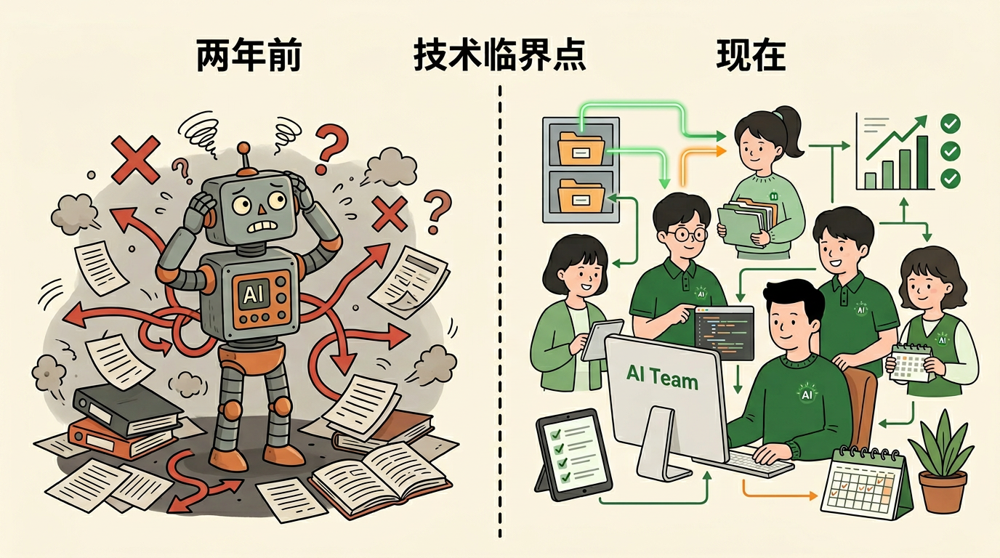
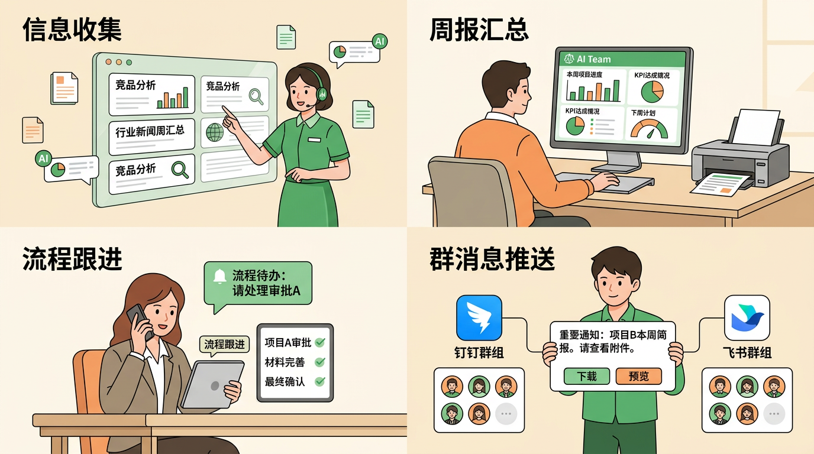
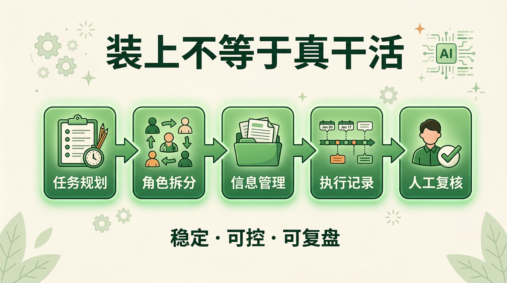
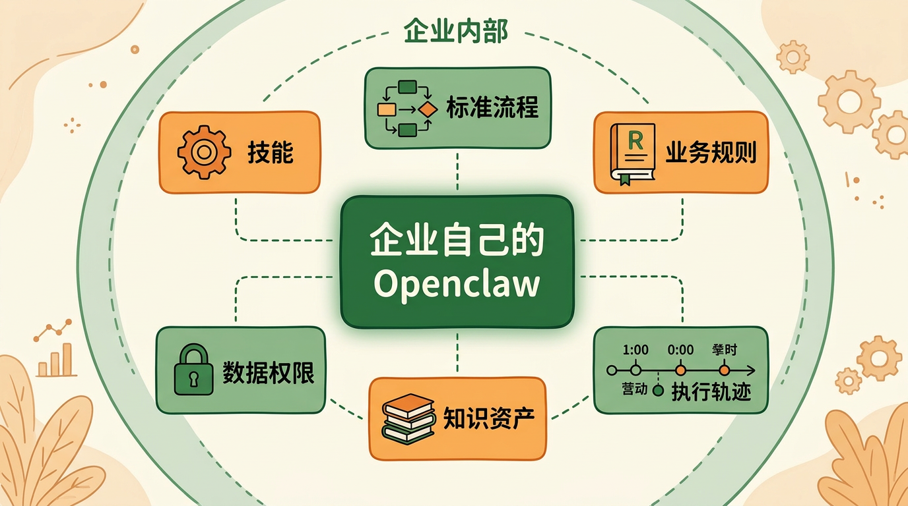
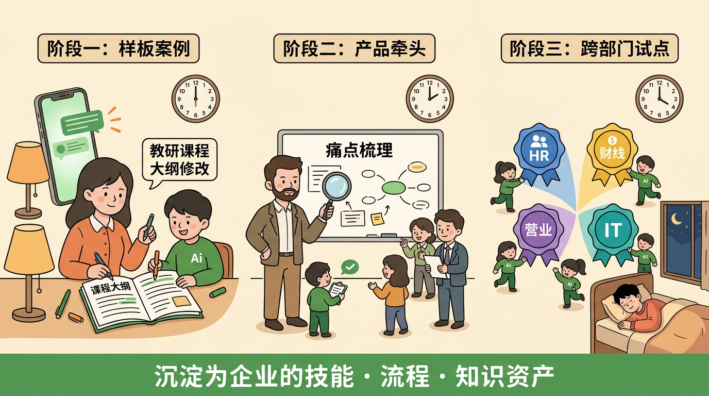

# 从 Openclaw 到企业自己的 Openclaw

大家好，今天我想先报一个喜。

先恭喜教研团队，已经把“课程大纲修改”这个场景做出来了。不是 Demo，不是停在讨论里，而是真的进了业务流程。更重要的是，这个小龙虾已经跑了一个多月了，不是今天灵光一现，也不是临时搭出来看一眼。它说明 Agent 对我们来说，已经不是“要不要试试看”，而是下一步怎么从一个样板，慢慢走到更多部门。

所以我今天想讲的，不只是 Openclaw 有多火。我更想讲的是另一件事：AI 已经开始从“会回答问题”，走到“能帮我们干活”。接下来我们要想的，是怎么把这件事从一个点做成公司的能力。

*图 1：Openclaw 火了，但企业真正要建设的是自己的 AI 工作系统。*

## 先讲清楚：Openclaw 到底是什么

先把概念说清楚。Openclaw，也就是大家最近常说的“龙虾”或者“小龙虾”，不是一个聊天机器人，也不只是一个更聪明的对话框。它更像一类会调工具、会跑任务、还能持续往下做的 AI Agent 系统。以前我们用 AI，更多还是问一句，答一句；但 Openclaw 代表的是另一种方向。你把一个任务交给它，它不只是给你一个答案，而是去查资料、调工具、整理信息，接着往下做，像一个能协作的数字同事。

那为什么它现在突然这么火？我觉得关键不在传播，在时机。两年前大家其实已经见过类似方向，比如 AutoGPT。当时很多人第一次看到，原来 AI 还能自己循环运行、自己想下一步、自己调工具，那一瞬间确实很震撼。但后来为什么没真正大规模落地？也不复杂，当时模型还不够稳。任务一长，它就容易乱，做着做着跑偏，或者卡在某一步来回打转。演示很好看，真拿来干活就差点意思。

到了 Openclaw 这一代，情况开始变了。模型更稳了，工具调用更强了，更关键的是，它开始像个真正工作的系统，能存资料、读文件、按阶段推进任务。换句话说，它不再只是“会想”，而是开始具备“会工作”的基础条件。所以 Openclaw 这波热度，背后不只是一次互联网热点，更像是 Agent 技术跨过了一个可用性的临界点。

*图 2：不是突然出现，而是 Agent 技术跨过了可用性的临界点。*

## 再看价值：它已经开始进入真实工作

也正因为这样，我们才需要认真看它。因为它已经不是只能围观的新鲜概念了，已经开始往真实工作里走了。比如，它可以每天自动收集行业信息，整理成一页摘要，再推送到部门群里；可以协助做日报、周报、KPI 汇总，把原来特别花时间的整理工作先做一轮；也可以去做一些重复性的运营跟进，比如提醒、通知、回收信息；还可以承担一部分研究整理类工作，先把资料筛一遍、归纳一遍，再交给人做判断。也就是说，Openclaw 最先适合的，不是特别模糊、特别复杂、特别高风险的事，而是高频、重复、规则相对明确、结果又能复核的工作。

*图 3：Openclaw 最先适合切入的是高频、重复、可复核的工作。*

所以它确实有价值。但这里有个很关键的转折：装上 Openclaw，不等于它就真的能稳定干活。这个地方，恰恰是企业最容易高估、也最该冷静的地方。

为什么这么说？因为让一个 Agent 真正干活，难点从来都不只是“能不能装起来”，而是“能不能稳定、可控、可复盘地跑下去”。这件事其实很好理解。资料一下子丢太多，它会乱；资料给太少，它又会做偏。任务太长、步骤太多，它就容易忘记最初要干什么。更麻烦的是，一旦它中途做错了，如果我们看不清它前面做过什么，就很难知道到底是哪一步出了问题。

所以，真正能干活的 Agent，不只是聪明，还得有工作方法、工作记录和回看能力。它得先知道这件事分几步做，什么时候先看摘要，什么时候再翻原文；复杂任务也不能让一个 Agent 硬扛到底，得拆给不同角色去处理。最重要的是，过程要留下来，这样人才能接手、检查、纠偏。对个人来说，这些问题可能只是“好不好用”；但对企业来说，这些事会直接变成稳定性、治理、安全和成本。

*图 4：企业难点不在安装，而在让 Agent 稳定、可控、可复盘地运行。*

## 关键转折：装上，不等于真能干活

我今天最想强调的一句话其实很简单：对个人来说，Openclaw 是效率工具；对企业来说，真正要建设的是属于自己的 Openclaw。

这里的“自己的”，不是说一定要起个自己的产品名字，而是说核心能力得握在企业自己手里。什么叫自己的 Openclaw？就是你有自己的 Skill、自己的 SOP、自己的业务规则、自己的数据和权限边界，也有自己的知识资产和执行轨迹。真正长期值钱的，从来不是某一次模型调用，而是企业在一次次试点里沉淀下来的流程、规则和经验。今天谁都可以装一个公版 Openclaw，但最后能变成企业能力的，一定是企业自己留下来的那一套东西。

也正因为这样，这件事不能完全交给外部平台。外部平台当然有价值，它能帮我们快速验证方向，知道这条路通不通。但企业不能把自己的核心 Agent 能力全压在外部平台上。原因其实也很直接。第一，内部的 Skill 和 SOP，本来就是公司的 know-how，是业务方法论；第二，数据、任务流和权限边界，天然不适合完全外置；第三，不同部门的工作流程差异很大，通用平台很难真正贴合；第四，企业最终要沉淀的是自己的 Agent 资产，而不是长期依赖别人的平台能力。再说得直白一点，企业最后要建的，不是一个账号，而是一套自己的工作系统。

*图 5：真正长期值钱的，是企业自己的技能、流程、规则和知识资产。*

## 对企业来说：真正要建设的是自己的 Openclaw

讲到这里，大家最关心的可能就是：那我们是不是已经到了可以开始做这件事的时候？我的判断是，是的。因为我们现在已经有了一个很重要的前提：教研这边不只是有一个真实落地案例，而且这个小龙虾已经连续跑了一个多月。

这件事很关键。它说明我们讨论的不是纸面概念，不是“也许以后可以”，而是真的已经有一个部门把这条路跑通了，而且稳定跑了一段时间。为什么教研能先跑出来？因为这类工作文档密集、流程相对稳定，而且结果可以人工复核。这恰恰是最适合 Agent 先落地的类型。更重要的是，教研这个案例不只是一个成功故事，它应该成为样板。它告诉我们，这件事已经从“概念讨论阶段”，走到了“可以开始小范围试验的阶段”。

## 现在能做：先把教研样板跑成组织方法

所以我建议，下一步不要一上来就讲全面试点，而是按一个更稳的节奏往前走：先由产研和业务一起做小范围试验，先给大家安全感。

第一，教研继续作为样板案例，把已经跑通的方法沉淀下来。  
第二，各业务部门先别急着上规模，先由产品、研发和业务一起把业务场景订清楚，挑出高频、低风险、结果可复核的切口。  
第三，我建议由产品团队牵头，联合研发和业务一起系统梳理高频痛点。因为一线业务最清楚自己每天最痛、最重复、最耗时的工作是什么，但未必知道怎么把它抽象成 Skill；而研发也需要尽早知道哪些环节能做、哪些环节要控风险。  
第四，等场景定清楚以后，再由产研和业务一起小范围跑测验，验证哪些流程真的值得沉淀，哪些地方还需要人工兜底，哪些边界还不能放开。  
第五，把这些测验里跑通的方法，逐步沉淀成企业自己的 Skill、SOP 和知识资产。这样最后留下来的，就不是几段零散 Prompt，也不是几次偶然成功的演示，而是一套越来越像企业自己的 Openclaw 能力体系。

*图 6：先有教研样板，再由产品牵头扩展到各业务部门试点。*

## 最后落点：从试点走向公司的长期能力

如果要用一句话收尾，我想说的是：Openclaw 解决的是大家对 Agent 的认知问题；接下来真正重要的，是我们要不要开始建设属于自己的 Openclaw。

教研已经证明这条路能跑通，而且已经稳定跑了一个多月。下一步，我们更该做的，不是继续围观龙虾有多火，也不是一下子铺到全公司，而是先由产研和业务一起做小范围试验。先把业务场景订清楚，再跑测验，再把跑通的痛点、方法和流程，逐步沉淀成公司的 Skill、SOP 和知识资产。这样走，节奏会更稳，大家也更有安全感。那时候我们留下来的，就不是一时热度，而是真正属于公司的 Agent 能力。
