# 记忆模块技术文档

> 状态：基于当前实现整理
> 范围：`src/electron/libs/memory-store.ts` 及其上下游集成
> 更新时间：2026-03-10

## 1. 目标与定位

记忆模块为 `VK-Cowork` 中的 Agent、Bot、心跳任务和应用内会话提供跨会话持久化能力，解决以下问题：

- 让 Agent 在新会话开始时自动获得用户偏好、项目决策、近期上下文和工作现场。
- 将“团队共享信息”和“单助理私有信息”隔离存储，避免不同助理之间互相污染。
- 为长任务提供工作记忆检查点，支持中断后续跑。
- 将会话日志沉淀为长期记忆、日记、经验文档和月度洞察，形成可持续演化的记忆体系。

当前实现并不是一个独立服务，而是一组围绕本地文件系统构建的能力集合，核心由 `memory-store.ts` 提供，并通过 MCP、IPC、HTTP API、Runner 和后台定时任务接入全系统。

先用一张总览图看整个模块在系统里的位置：

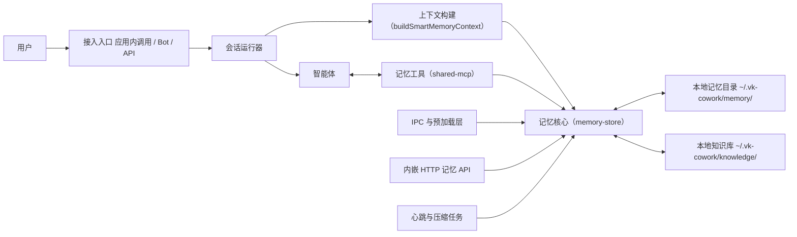

## 2. 核心概念

### 2.1 两个维度

记忆系统同时按“检索层级”和“生命周期”两个维度组织信息。

#### 检索层级

- `L0`：目录索引层，对应 `.abstract`，用于快速告诉 Agent “有什么可读”。
- `L1`：提炼层，对应 `insights/`、`lessons/`、知识文档等中等粒度内容。
- `L2`：原始日志层，对应 `daily/` 和各助理的 `daily/`，保存当天上下文与对话轨迹。

#### 生命周期

- `P0`：永久信息，例如稳定偏好、长期身份信息、长期有效的架构决策。
- `P1`：90 天有效信息，格式为 `[P1|expire:YYYY-MM-DD]`。
- `P2`：30 天有效信息，格式为 `[P2|expire:YYYY-MM-DD]`。

### 2.2 共享与私有

- 共享记忆：所有助理都可见，适合团队级决策、用户身份信息、所有助理都应知道的规则。
- 私有记忆：只属于某个 `assistantId`，适合该助理自己的工作偏好、项目上下文、私有环境事实。

### 2.3 三类主要载体

- 长期记忆：`MEMORY.md`
- 工作记忆：`SESSION-STATE.md`
- 每日日志：`daily/YYYY-MM-DD.md`

其中，`SESSION-STATE.md` 用于保存“当前未完成任务的工作现场”，帮助助理跨会话续跑，不承担长期知识沉淀职责。

## 3. 磁盘结构

根目录位于 `~/.vk-cowork/memory/`。

```text
~/.vk-cowork/memory/
├── .abstract                     # 根索引（L0）
├── MEMORY.md                     # 共享长期记忆
├── SESSION-STATE.md              # 兼容旧版的全局工作记忆
├── daily/                        # 共享 daily（L2）
├── insights/                     # 共享 insights（L1，偏 legacy）
├── lessons/                      # 共享 lessons
├── sops/                         # 历史 SOP 文档（只读存量）
├── archive/                      # 共享过期条目归档
├── .migrated-v2                  # V2 迁移标记
└── assistants/
    └── {assistantId}/
        ├── MEMORY.md             # 助理私有长期记忆
        ├── SESSION-STATE.md      # 助理私有工作记忆
        ├── daily/                # 助理私有对话日志
        ├── insights/             # 助理私有月度洞察
        ├── lessons/              # 助理私有 lessons
        └── archive/              # 助理私有过期归档
```

另外，知识库与记忆系统是弱耦合关系：

- `~/.vk-cowork/knowledge/docs/`：正式知识文档
- `~/.vk-cowork/knowledge/experience/`：经验候选及相关沉淀

记忆模块会在构建上下文和刷新索引时把这些知识文档纳入可发现范围。

从“共享层 / 私有层 / 知识层”的关系看，磁盘拓扑可以理解为：

```mermaid
flowchart TB
  Root["记忆根目录 ~/.vk-cowork/memory/"]
  Root --> Shared["共享记忆层"]
  Root --> Assist["助理私有层 assistants/{assistantId}/"]
  Root -.关联.-> Knowledge["知识库 ~/.vk-cowork/knowledge/"]

  Shared --> RootIndex["根索引 .abstract"]
  Shared --> SharedMemory["共享长期记忆 MEMORY.md"]
  Shared --> SharedState["兼容工作记忆 SESSION-STATE.md"]
  Shared --> SharedDaily["共享日志 daily/*.md"]
  Shared --> SharedInsights["共享洞察 insights/*.md"]
  Shared --> SharedLessons["共享 lessons/*.md"]
  Shared --> SharedSops["存量 SOP sops/*.md"]
  Shared --> SharedArchive["共享归档 archive/*.md"]

  Assist --> PrivateMemory["私有长期记忆 MEMORY.md"]
  Assist --> PrivateState["私有工作记忆 SESSION-STATE.md"]
  Assist --> PrivateDaily["私有日志 daily/*.md"]
  Assist --> PrivateInsights["私有洞察 insights/*.md"]
  Assist --> PrivateLessons["私有 lessons/*.md"]
  Assist --> PrivateArchive["私有归档 archive/*.md"]

  Knowledge --> KnowledgeDocs["正式知识 docs/*.md"]
  Knowledge --> KnowledgeExp["经验候选 experience/*"]
```

## 4. 核心模块分工

### 4.1 `src/electron/libs/memory-store.ts`

这是记忆模块的事实核心，职责包括：

- 初始化目录、种子文件和迁移逻辑
- 读写共享长期记忆、工作记忆、每日日志、SOP
- 封装 `ScopedMemory`，处理 per-assistant 读写
- 生成根索引 `.abstract`
- 构建运行时注入的 smart memory context
- 运行过期条目 janitor
- 提供对话自动双写能力 `recordConversation()`

### 4.2 `src/electron/libs/shared-mcp.ts`

把记忆能力暴露成 Agent 可调用的 MCP 工具，包括：

- `save_memory`
- `save_working_memory`
- `read_working_memory`
- `query_team_memory`
- `distill_memory`
- `save_experience`

这是 Agent 主动写入和读取记忆的主要入口。

### 4.3 `src/electron/main.ts` + `src/electron/preload.cts`

为应用内调用暴露 IPC 能力：

- `memory-read`
- `memory-write`
- `memory-list`

前端通过 `window.electron.memoryRead()` / `memoryWrite()` / `memoryList()` 访问这些能力。

### 4.4 `src/electron/api/routes/memory.ts`

提供嵌入式 HTTP API，便于 API sidecar 或外部进程读取和更新共享记忆。

### 4.5 `src/electron/ipc-handlers.ts`

在应用内会话结束后自动生成摘要，并把内容写入共享 daily 和助理私有 daily，补齐“应用内会话没有 Bot 双写”的缺口。

### 4.6 `src/electron/libs/heartbeat.ts`

负责两类后台任务：

- 心跳巡检：基于 daily 增量驱动助理主动巡检
- 每周压缩：尝试把 L2 日志压缩为 L1 洞察

### 4.7 `src/electron/libs/runner.ts` 和 `src/electron/api/services/runner.ts`

在启动新的 Agent 会话时调用 `buildSmartMemoryContext()`，把记忆上下文拼接到 prompt 前面。

模块之间的依赖关系可以概括为：

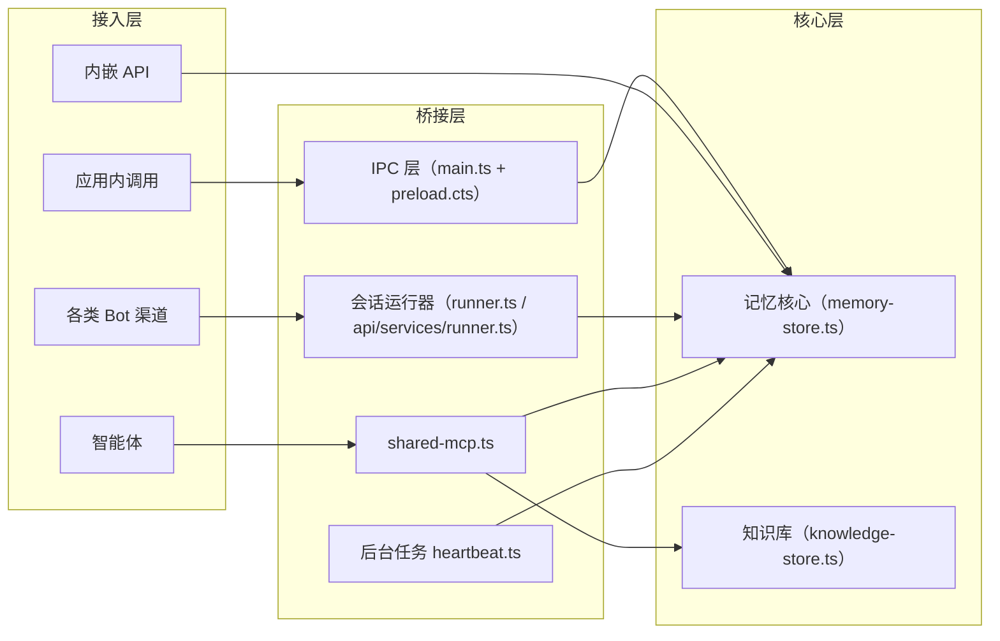

## 5. 数据模型与格式约定

## 5.1 长期记忆条目格式

长期记忆要求每个条目以列表项开头，并带生命周期标签：

```md
- [P0] 用户偏好中文回复
- [P1|expire:2026-06-01] 项目使用本地 sidecar API 作为主执行通道
- [P2|expire:2026-04-01] 本周临时测试环境地址为 http://127.0.0.1:3001
```

`save_memory` 会校验这个格式，并做两类自动修正：

- 去掉错误的 XML 闭合标签，如 `[/P0]`
- 对只有标签但没前缀 `- ` 的行自动补上 `- `

### 5.2 工作记忆格式

`SESSION-STATE.md` 更像任务接力便签，而不是长期记忆库。它主要保存当前任务、关键上下文、相关 SOP 和最近操作历史，目的是让下一次会话能快速接上现场。

工作记忆最终落盘为结构化 Markdown：

```md
# Working Memory Checkpoint
> Updated: 2026/03/10 14:25:01

## 当前任务
修复心跳重复触发问题

## 关键上下文
已确认共享 daily 无变化，但 assistant daily 持续增长。

## 相关 SOP
- memory-management

## 操作历史
- 检查 heartbeat.ts
- 验证 session 结束回调
```

### 5.3 每日日志格式

共享 daily 以简短摘要为主，便于心跳和索引使用，例如：

```md
- 14:20:11 [app/default-assistant] 普通会话 — 修复 memory compact timer 的 catch-up 逻辑
```

助理私有 daily 则保存更完整的块状上下文，例如：

```md
## 14:20:11
**会话**: 修复记忆压缩问题

[U] ...
[A] ...
```

## 6. 启动、初始化与迁移

`ensureDirs()` 在多数公开入口里都会被调用，用于确保系统可用。它会做以下事情：

1. 创建基础目录。
2. 为 `insights/` 和 `lessons/` 生成初始 `.abstract`。
3. 如果 `sops/memory-management.md` 不存在，则写入默认记忆管理 SOP。
4. 执行 V2 迁移：把旧的全局 `SESSION-STATE.md`、`insights/`、`lessons/`、`archive/` 迁移到 `assistants/default-assistant/`。
5. 写入 `.migrated-v2`，避免重复迁移。

迁移策略的原则是：

- 保留旧数据
- 迁移后共享目录重建
- 原文件或目录改名为 `*.pre-v2` 作为备份

## 7. 读路径：记忆如何进入 Agent

### 7.1 主流程

新会话启动时，Runner 会在真正执行 Agent 之前调用：

- `buildSmartMemoryContext(prompt, assistantId, sessionCwd)`

然后把返回结果拼接为：

```text
<memory-context>

用户真实 prompt
```

对应的读路径时序如下：

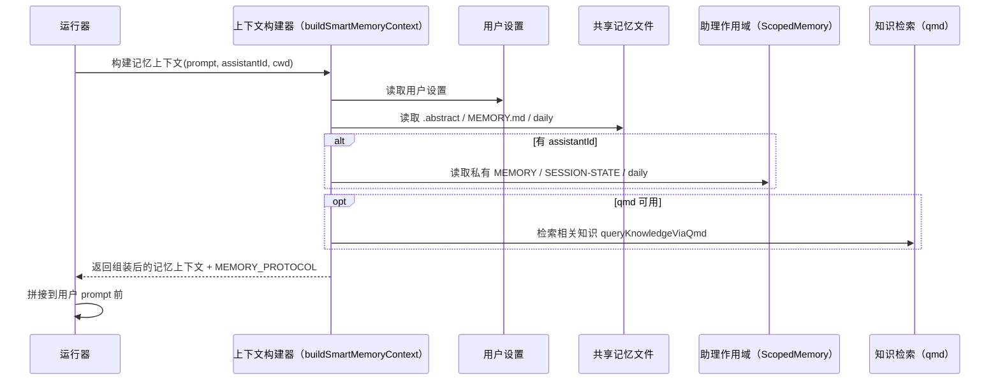

### 7.2 上下文组装内容

`buildSmartMemoryContext()` 会并行读取以下数据：

- 用户档案与全局指令（来自 user settings）
- 根 `.abstract`
- 共享 `MEMORY.md`
- 私有 `MEMORY.md`（如果提供了 `assistantId` 且隔离开关开启）
- 共享或私有 `SESSION-STATE.md`
- 今日共享 daily
- 今日助理私有 daily

随后它还会：

- 视情况调用本地 `qmd` CLI，对知识库做语义检索
- 将命中的知识文档片段以“相关知识（语义检索）”形式注入上下文
- 追加 `MEMORY_PROTOCOL`，告诉模型如何正确使用记忆工具和记忆层级

可选参数：

- `opts.skipDailyLog = true`：跳过 shared daily 和 assistant daily 注入。当前主要用于文件分析等场景，避免把旧日志中的文件内容带进本轮输出。

### 7.3 `memoryIsolationV3`

`loadUserSettings()` 中的 `memoryIsolationV3` 控制是否启用共享/私有双层模式：

- 默认开启
- 关闭时，private 写入会自动回退为 shared 写入
- 关闭时，prompt 中也不会再强调“你的专属记忆”

### 7.4 按需加载思想

该模块采用“轻注入 + 按需展开”的策略：

- 始终注入索引与核心记忆
- 不默认注入历史 daily、完整 SOP、旧 insights
- 由 Agent 根据 `.abstract` 自己决定是否进一步读取文件

这能降低 prompt 体积，并避免无关历史污染当前会话。

## 8. 写路径：记忆如何被写入

先看整体写入流，系统里其实有三条不同来源的写路径：

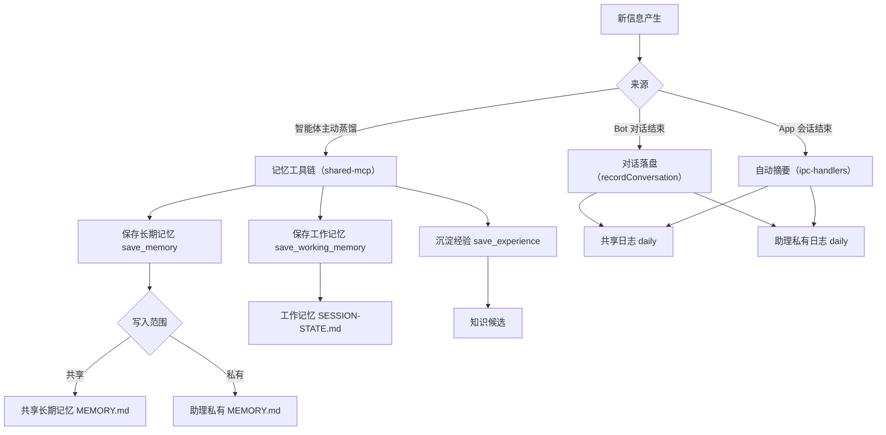

### 8.1 Agent 主动写入

Agent 主要通过 MCP 工具写入记忆。

#### `save_memory`

职责：

- 校验生命周期标签格式
- 根据 `scope` 决定写入共享或私有长期记忆
- 写入后刷新根 `.abstract`

行为细节：

- `scope=shared`：追加到共享 `MEMORY.md`
- `scope=private`：必须有 `assistantId`，追加到 `assistants/{id}/MEMORY.md`
- 若隔离关闭，则 private 自动降级为 shared

#### `save_working_memory`

职责：

- 将当前任务、关键上下文、操作历史写入 `SESSION-STATE.md`
- 优先写入助理私有工作记忆

#### `read_working_memory`

职责：

- 读取最近一次保存的工作记忆检查点

#### `query_team_memory`

职责：

- 在其他助理的私有 `MEMORY.md` 中做关键词匹配
- 返回匹配条目，但不修改任何内容

适用场景：

- 当前助理在索引中看到“其他助理可能处理过相关问题”
- 需要跨助理借用历史经验，但不直接开放所有记忆全文

#### `distill_memory`

这不是直接写文件的工具，而是一个“蒸馏引导器”。它会：

- 读取 `memory-management` SOP
- 告诉 Agent 如何把本次任务拆分成长期记忆、工作记忆和经验沉淀
- 引导 Agent 继续调用 `save_memory` / `save_working_memory` / `save_experience`

#### `save_experience`

该工具并不把内容写到 `memory/`，而是写入知识库候选，用于沉淀经过验证的复杂流程。

Agent 主动蒸馏的细节时序如下：

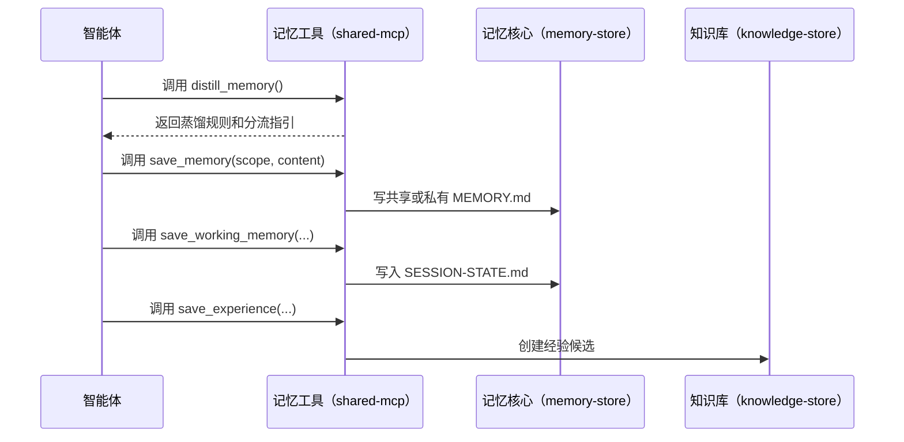

### 8.2 Bot 会话自动写入

钉钉、飞书、Telegram、QQ Bot 在会话结束后会调用：

- `recordConversation(content, { assistantId, assistantName, channel })`

它会自动双写：

1. 全文写入助理私有 daily
2. 一行摘要写入共享 daily

这让心跳和压缩任务都能消费到 Bot 侧产生的新记忆。

如果调用时没有传 `assistantId`，则只会写共享 daily 摘要，不会生成私有 daily。

### 8.3 App 内会话自动写入

应用内普通会话在 `ipc-handlers.ts` 的会话完成阶段会自动记录：

1. 使用 `buildConversationDigest(allMessages)` 生成摘要
2. 共享 daily 写入一行 summary
3. 助理私有 daily 写入最多 3000 字的详细 digest

会跳过以下特殊会话：

- 心跳会话
- 经验候选会话
- 记忆压缩会话
- background 会话

自动落盘的 App 会话流程可以简化为：

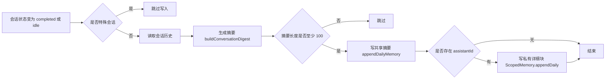

## 9. 索引系统：`.abstract`

`.abstract` 是记忆系统的 L0 入口，`refreshRootAbstract()` 会自动生成它。

根索引通常包含以下区块：

- 共享 SOP 列表
- 正式知识文档列表
- 最近共享 daily 摘要
- 共享长期记忆中的标题或标签条目
- 当前助理的私有长期记忆摘要
- 当前助理的近期对话日志摘要
- 当前助理是否存在工作记忆
- 当前助理的 insights 列表
- 其他助理的主题提示（便于后续 `query_team_memory`）
- 共享 insights 列表
- recency 时间戳

设计目标是“让 Agent 先知道去哪读”，而不是把所有内容都塞进 prompt。

`.abstract` 的生成过程可以看成一个“多源汇总器”：

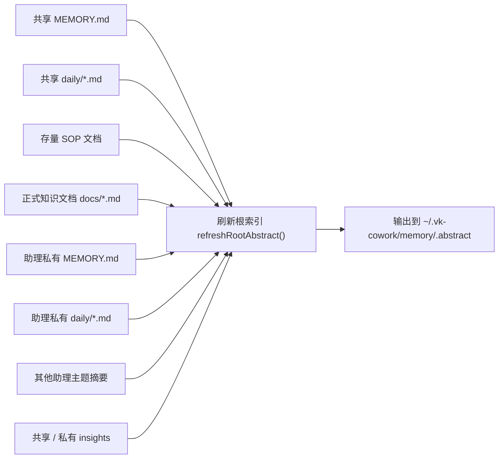

## 10. 后台任务

### 10.1 Janitor：过期条目归档

`runMemoryJanitor()` 负责扫描共享和私有 `MEMORY.md` 中的过期 `P1` / `P2` 条目。

行为：

- 提取过期条目
- 追加写入 `archive/YYYY-MM.md`
- 从原始 `MEMORY.md` 中移除
- 刷新根索引

该逻辑既支持共享层，也支持每个 `ScopedMemory` 私有层。

### 10.2 Heartbeat：增量巡检

`startHeartbeatLoop()` 以 1 分钟为周期调度，但是否真正触发由以下条件决定：

- 是否到达该助理的心跳时间窗口
- 自上次心跳后共享 daily 或助理 daily 是否发生变化
- 是否有错误后的退避重试需求
- 是否长时间沉默需要强制巡检
- 是否存在连续 no-action，进而拉长有效心跳间隔

心跳 prompt 只读取“今天新增的部分”，而不是整份日志，依赖两组 offset：

- `lastMemoryOffset`
- `lastAssistantMemoryOffset`

这两个 offset 是字符级偏移量，通过 `content.slice(prevOffset)` 截取。首次读取时不会从 0 开始，而是回退到“文件末尾最近 `DAILY_MEMORY_MAX_CHARS`（当前为 4000）字符”的位置，因此首次注入的是最新片段，而不是全天全文。

除了 offset 之外，Heartbeat 还有几层运行控制：

- `mtime` 未变化时直接跳过，避免无意义巡检
- 连续 `noAction` 会拉长有效心跳间隔
- 连续报错会进入指数退避
- 长时间没有完成记录时，会触发 force run，避免永久沉默

Heartbeat 的判定流程大致如下：

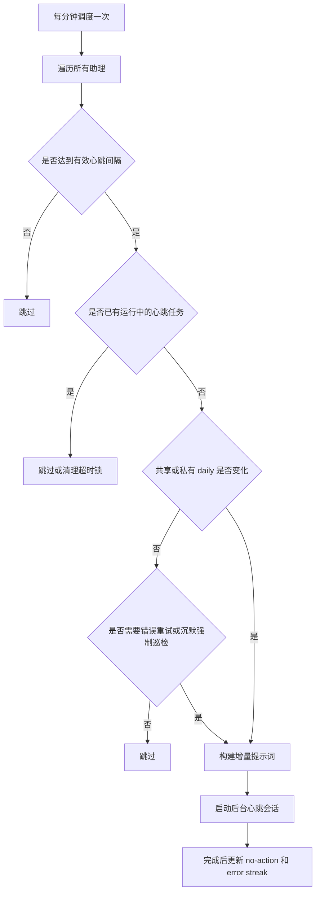

### 10.3 每周压缩：L2 到 L1

`startMemoryCompactTimer()` 负责每周一 `03:xx` 触发记忆压缩，会：

1. 基于 ISO 周生成 `YYYY-Wnn` key
2. 读取 `.last-compact-key` 判断本周是否已经执行
3. 在应用启动时做 catch-up（当前实现为延迟 15 秒补跑）
4. 启动一个标题为 `[记忆压缩] L2→L1` 的后台 Agent 会话

当前压缩仍是“让 Agent 自己去读文件、写文件”的模式，而不是纯代码控制的程序化压缩。

这意味着它有两个特点：

- 灵活，但可验证性较弱
- 依赖 Agent 会话成功完成才能视为成功

每周压缩的当前实现流程如下：

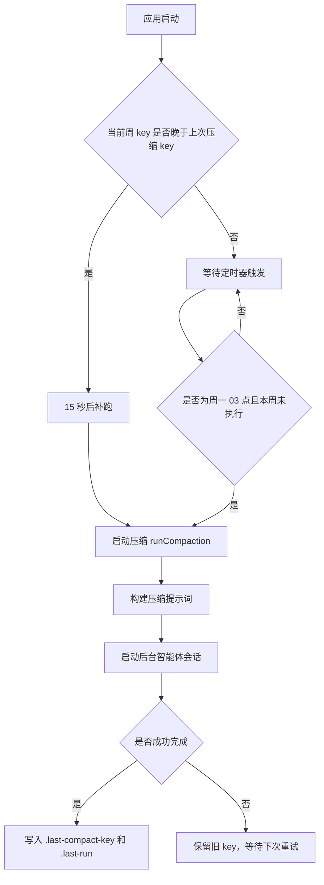

## 11. 对外接口

### 11.1 IPC 接口

前端主要通过以下能力访问记忆系统：

#### `memory-read(target, date?, assistantId?)`

支持的 `target`：

- `long-term`
- `assistant-long-term`
- `daily`
- `assistant-daily`
- `context`
- `session-state`
- `abstract`

#### `memory-write(target, content, date?, assistantId?)`

支持的 `target`：

- `long-term`
- `assistant-long-term`
- `daily-append`
- `daily`
- `assistant-daily-append`
- `session-state`
- `session-state-clear`

#### `memory-list(assistantId?)`

返回：

- `memoryDir`
- `summary`
- `dailies`
- `assistantDailies`
- `lastCompactionAt`

### 11.2 HTTP API

`src/electron/api/routes/memory.ts` 目前提供：

- `GET /memory`
- `GET /memory/long-term`
- `PUT /memory/long-term`
- `GET /memory/daily/:date?`
- `POST /memory/daily`
- `PUT /memory/daily/:date`
- `GET /memory/list`

这些接口以共享层为主，带 `assistantId` 时只在部分场景读取 `ScopedMemory`。

对外访问面的关系如下：

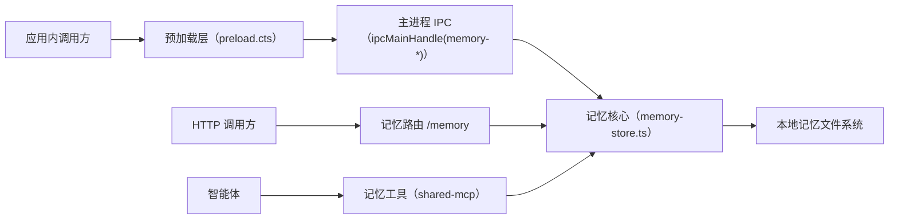

## 12. `ScopedMemory` 设计

`ScopedMemory` 是 per-assistant 操作的核心封装，目标是避免上层遗漏 `assistantId`。

它负责：

- 私有长期记忆读写
- 私有工作记忆读写
- 私有 daily 读写
- 私有 insights / archive 路径管理
- 私有 janitor
- 私有 summary 统计

与全局函数相比，`ScopedMemory` 更适合任何明确属于某个助理的调用链。

从职责边界看，`ScopedMemory` 相当于在共享记忆之上加了一层“助理作用域适配器”：

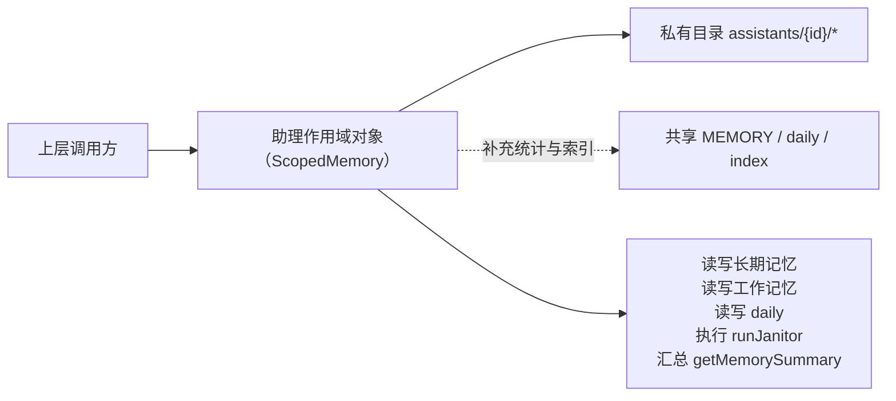

## 13. 并发与可靠性策略

### 13.1 原子写

记忆系统大多数写操作采用“先写 `.tmp`，再 rename”的方式，避免半写入文件。

### 13.2 写锁

`atomicWriteWithLock()` 基于 `writeLocks` Map 提供按文件粒度的串行写保护，用于避免并发覆盖。

说明：当前大多数公开写接口仍使用同步版 `atomicWrite()`，而不是带锁版，因此“支持文件级锁”更多是底层能力储备，并非所有路径都已完全接入。

### 13.3 非阻塞刷新

刷新 `.abstract`、运行 janitor、记录压缩元信息等操作尽量采用非阻塞方式，避免影响主流程成功率。

## 14. 已知限制与实现现状

### 14.1 `buildMemoryContext()` 仍是 legacy alias

`buildMemoryContext()` 只是 `buildSmartMemoryContext("")` 的别名，不接收 `assistantId`。

这带来两个直接影响：

- `GET /memory` 读取 context 时没有把当前助理私有上下文拼进去
- IPC 的 `memory-read("context")` 也同样返回未带 assistant scope 的上下文

如果后续要让应用内调用或 API 正确展示某个助理的完整上下文，需要改为显式调用 `buildSmartMemoryContext(prompt, assistantId, cwd)`。

### 14.2 压缩任务仍依赖 Agent 自主执行

当前的 weekly compaction：

- 由 `heartbeat.ts` 发起
- 通过 Agent 会话读取 daily
- 由 Agent 自己写 `insights/*.md`

这比程序化实现更难校验，也更容易出现“会话成功但结果不完整”的情况。`plan/02-programmatic-memory-compaction.md` 已提出下一阶段改造方案。

### 14.3 共享 `SESSION-STATE.md` 仍保留为兼容层

虽然新架构倾向使用 `assistants/{id}/SESSION-STATE.md`，但全局 `SESSION-STATE.md` 仍然存在，用于兼容没有 `assistantId` 的旧调用。

### 14.4 `sops/` 已经转为存量区

根索引中仍会展示 `sops/`，但新经验沉淀已转向 `save_experience` + knowledge candidate 审核流。

## 15. 典型时序

### 15.1 新会话启动

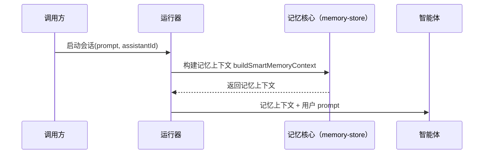

### 15.2 Agent 任务完成后蒸馏

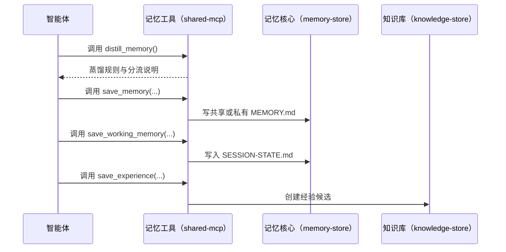

### 15.3 会话结束自动记录

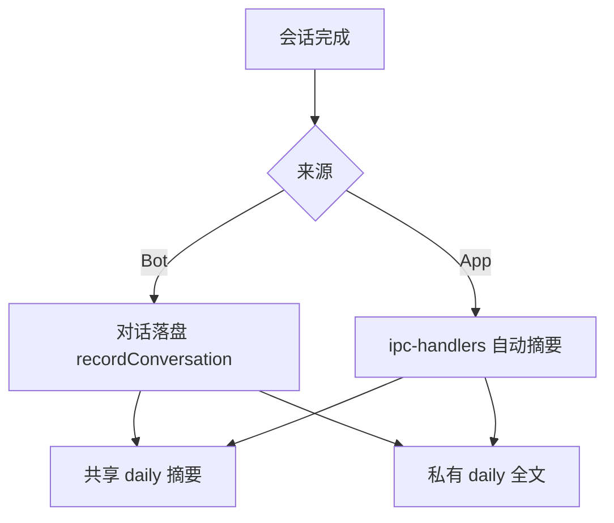

## 16. 相关代码入口

建议按下面顺序阅读源码：

1. `src/electron/libs/memory-store.ts`
2. `src/electron/libs/shared-mcp.ts`
3. `src/electron/libs/runner.ts`
4. `src/electron/api/services/runner.ts`
5. `src/electron/ipc-handlers.ts`
6. `src/electron/libs/heartbeat.ts`
7. `src/electron/main.ts`
8. `src/electron/api/routes/memory.ts`
9. `src/electron/preload.cts`

## 17. 相关历史文档

- `plan/01-memory-system-diagnosis.md`：记录了第一阶段问题诊断与修复。
- `plan/02-programmatic-memory-compaction.md`：记录了第二阶段“程序化压缩”重构设计。

## 18. 后续建议

如果继续完善该模块，优先级建议如下：

1. 把 context 类接口改成显式支持 `assistantId`，消除 legacy alias 带来的误导。
2. 将 weekly compaction 改为程序化实现，提升可观测性和可验证性。
3. 统一公开写接口对 `atomicWriteWithLock()` 的使用，进一步降低并发覆盖风险。
4. 继续收敛 legacy 目录（如共享 `SESSION-STATE.md`、共享 `insights/`）的角色，明确哪些仍在生产使用，哪些只为兼容保留。
